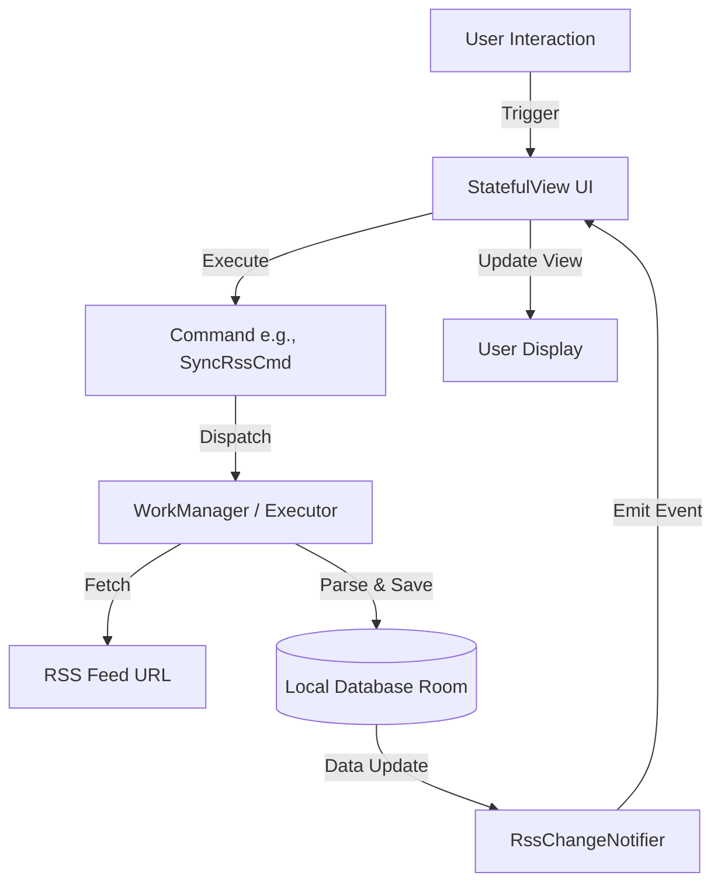

# a-news-provider

A simple and easy to use RSS aggregator that deliver news to your smartphone.

**For Users:**
<ul>
  <li>Easily add new feed using shortcut</li>
  <li>Support RSS XML</li>
  <li>Support Atom XML</li>
  <li>Support background sync</li>
  <li>Simple interface to add and read your news</li>
  <li>Support dark mode and light mode</li>
  <li>Accessibility friendly with one hand mode</li>
  <li>Accessibility friendly on screen reader (tested with TalkBack)</li>
</ul>

This project is intended for demo app for [a-navigator](https://github.com/rh-id/a-navigator) and [a-provider](https://github.com/rh-id/a-provider) library usage.
The app still works as production even though it is demo app.

## Architecture

This application is built using a component-based architecture leveraging specific libraries for navigation and dependency injection.

### Core Libraries

*   **[a-navigator](https://github.com/rh-id/a-navigator):** Handles the UI navigation and lifecycle.
    *   **StatefulView:** Instead of Fragments or Activities for every screen, the app uses `StatefulView`. This allows for a more flexible and lightweight view hierarchy.
    *   **INavigator:** The interface used to push/pop pages and manage the navigation stack (e.g., `mNavigator.push(Routes.SETTINGS_PAGE)`).
*   **[a-provider](https://github.com/rh-id/a-provider):** A Service Locator library for Dependency Injection.
    *   **Provider:** Central registry for dependencies.
    *   **Modules:** Dependencies are organized in modules (e.g., `AppProviderModule`, `CommandProviderModule`). UI components implement `RequireComponent<Provider>` to access these dependencies.

### Command Pattern

Business logic is encapsulated using the **Command Pattern**. This decouples the UI from the execution logic.
*   **Commands:** Classes like `SyncRssCmd` or `RssQueryCmd` handle specific tasks (syncing feeds, querying DB).
*   **Execution:** The UI retrieves a command instance via `a-provider` and executes it.
*   **Benefit:** Keeps UI classes (StatefulViews) clean and testable.

### Reactive Programming

*   **RxJava/RxAndroid:** Used heavily for asynchronous operations and event handling.
*   **Notifiers:** Components like `RssChangeNotifier` use Rx subjects to emit updates to the UI when data changes.

## Logic Flow

The following diagram illustrates the typical data flow when a user interacts with the app (e.g., refreshing the feed):

1.  **Action:** User triggers an action (e.g., clicks "Sync").
2.  **Command:** The UI invokes the corresponding Command.
3.  **Background Work:** The Command offloads work to `WorkManager` or a background `Executor`.
4.  **Data Operation:** Data is fetched from the network and saved to the local Room database.
5.  **Notification:** Once the DB is updated, a `Notifier` emits an event.
6.  **UI Update:** The UI, listening to the `Notifier` via RxJava, updates the display.

## Development & CI/CD

### GitHub Workflows

The project uses GitHub Actions for CI/CD:

*   **Android CI (`gradlew-build.yml`):**
    *   Triggered on push/pull request to `master`.
    *   Runs unit tests and builds the project using `./gradlew build` to ensure code integrity.
*   **Android Release APKs (`android-release.yml`):**
    *   Triggered when a tag starting with `v*` is pushed.
    *   Builds Debug and Release APKs.
    *   Creates a GitHub Release and attaches the APKs and changelog.

### Fastlane

The `fastlane/` directory contains metadata for the Android app (images, descriptions). While the build process currently uses Gradle directly in GitHub Actions, the Fastlane structure is maintained for potential store deployment and metadata management.

## Project Structure

*   `app/`: Main application module containing UI, Commands, and DI configuration.
*   `base/`: Common components, Database entities (Room), and base application logic.
*   `component-network/`: Network related components (Retrofit/OkHttp) for fetching feeds.
*   `fastlane/`: Store metadata and potential automation scripts.
*   `.github/`: GitHub Actions workflow configurations.

## Screenshots

## Support this project
Consider donation to support this project
<table>
  <tr>
    <td><a href="https://trakteer.id/rh-id">https://trakteer.id/rh-id</a></td>
  </tr>
</table>
