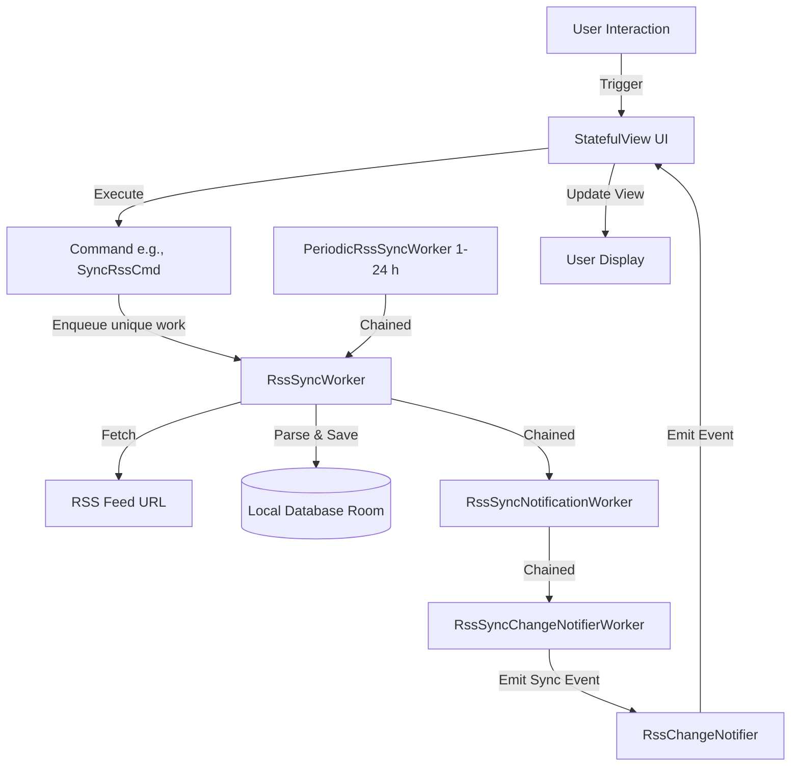

# a-news-provider

A simple and easy to use RSS aggregator that deliver news to your smartphone.

**For Users:**
<ul>
  <li>Easily add new feed using the home screen shortcut</li>
  <li>Add a feed by sharing a link from your browser or other apps</li>
  <li>Open OPML files directly from your file manager, in addition to importing and exporting feeds via OPML</li>
  <li>Support RSS 2.0, Atom, and RDF (RSS 1.0) feed formats, including <code>media:content</code>, <code>media:thumbnail</code>, and <code>enclosure</code> elements for attached images and videos</li>
  <li>Download attached videos to <code>Downloads/&lt;feedName&gt;/</code> via the system download manager; attached images are displayed in the item detail when the "download image" setting is enabled</li>
  <li>Star items as favorites and filter the list by All / Unread / Read / Favorites</li>
  <li>Sort items by newest or oldest, and mark all items as read (globally or per channel)</li>
  <li>Configurable periodic background sync with a 1-24 hours interval (default: every 6 hours, can be toggled off)</li>
  <li>Per-channel grouped sync notifications with unread counts (requires the Notifications permission on Android 13+)</li>
  <li>Rename or delete feeds</li>
  <li>Support editing feed item link</li>
  <li>Copy feed item links and channel links to clipboard</li>
  <li>Offline/online detection with SnackBar feedback; syncs run automatically once the device is back online</li>
  <li>Simple interface to add and read your news</li>
  <li>Theme selection: follow system, light, or dark mode</li>
  <li>Accessibility friendly with one hand mode (bottom-anchored layouts)</li>
  <li>Accessibility friendly on screen reader (tested with TalkBack)</li>
  <li>View the in-app log file (share and clear supported)</li>
  <li>Open-source licenses screen</li>
  <li>Available in 10 languages: English, Indonesian, German, Estonian, French, Icelandic, Italian, Norwegian (Bokmål &amp; Nynorsk), and Romansh</li>
  <li>Support Android 5.0 (API 21) and above</li>
</ul>

This project is intended for demo app for [a-navigator](https://github.com/rh-id/a-navigator) and [a-provider](https://github.com/rh-id/a-provider) library usage.
The app still works as production even though it is demo app.

## Architecture

This is a single-activity application built using a component-based architecture leveraging specific libraries for navigation and dependency injection. Every screen is a page managed by [a-navigator](https://github.com/rh-id/a-navigator), and all dependencies are provided by [a-provider](https://github.com/rh-id/a-provider).

### Core Libraries

*   **[a-navigator](https://github.com/rh-id/a-navigator):** Handles the UI navigation and lifecycle.
    *   **StatefulView:** Instead of Fragments or Activities for every screen, the app uses `StatefulView`. This allows for a more flexible and lightweight view hierarchy.
    *   **INavigator:** The interface used to push/replace/pop pages and manage the navigation stack (e.g., `mNavigator.push(Routes.SETTINGS_PAGE)`). Routes are simple path strings (e.g., `HOME_PAGE = "/"`, `SETTINGS_PAGE = "/settings"`).
    *   **Scoped providers:** Each `StatefulView` receives its own scoped `StatefulViewProvider` with its own commands and `RxDisposer`, so page state and subscriptions are disposed automatically when the page is popped.
*   **[a-provider](https://github.com/rh-id/a-provider):** A Service Locator library for Dependency Injection.
    *   **Provider:** Central registry for dependencies.
    *   **Modules:** Dependencies are organized in modules: `AppProviderModule`, `BaseProviderModule`, `DatabaseProviderModule`, `NetworkProviderModule`, `CommandProviderModule`, `RxProviderModule`, and `StatefulViewProviderModule`. UI components implement `RequireComponent<Provider>` to access these dependencies.

### Command Pattern

Business logic is encapsulated using the **Command Pattern**. This decouples the UI from the execution logic.
*   **Commands:** The app currently has 11 commands: `PagedRssItemsCmd`, `NewRssChannelCmd`, `RenameRssFeedCmd`, `SyncRssCmd`, `RssQueryCmd`, `EditRssLinkCmd`, `UpdateRssItemIsReadCmd`, `UpdateRssItemIsFavoriteCmd`, `DeleteRssChannelCmd`, `OpmlCmd`, and `MarkAllReadCmd`.
*   **Execution:** The UI retrieves a command instance via `a-provider` and executes it.
*   **Threading:** Commands run on a shared weighted thread pool (max weight 5); network work is offloaded to WorkManager.
*   **Benefit:** Keeps UI classes (StatefulViews) clean and testable.

### Reactive Programming

*   **RxJava 3 / RxAndroid:** Used heavily for asynchronous operations and event handling.
*   **Notifiers:** Components like `RssChangeNotifier` (an event hub for new/updated/deleted channels, synced items, updated items, and mark-read events) and `RssChannelStateNotifier` (selected channel and unread-count state) use Rx subjects to emit updates to the UI, while `RssRepository` persists feed data to the local database.
*   **Preferences:** `AppSharedPreferences` exposes user preferences as Rx flows so UI screens react to setting changes.

### Background Work (WorkManager)

Sync operations are executed as WorkManager chains with a `NetworkType.CONNECTED` constraint:

*   **Manual sync:** unique work `RssSyncWorker` chained to `RssSyncChangeNotifierWorker` (enqueued with `ExistingWorkPolicy.KEEP` to avoid duplicate syncs).
*   **Periodic sync:** unique periodic `PeriodicRssSyncWorker` chaining `RssSyncWorker` → `RssSyncNotificationWorker` → `RssSyncChangeNotifierWorker`. The notification worker posts the per-channel grouped notifications with unread counts.
*   **New feed / OPML import:** a one-time `NewRssWorker` job with the connectivity constraint, and a one-time `OpmlParseWorker` job that parses the local OPML file (no constraint).

### Persistence (Room)

*   Room database `a-news-provider.db` (version 8, with migrations from version 1 to 8). Entities: `RssChannel`, `RssItem`, and `AndroidNotification`.
*   Read and favorite state is synced across channels by item link, so the same article shared by multiple feeds keeps its state.
*   Feed lists are paginated using `LIMIT`-based queries (no androidx.paging).

### Networking (Volley)

*   Feed downloads use a Volley `RequestQueue` (HurlStack) with a 20 MiB disk cache, plus an `ImageLoader` with a 20-entry memory LruCache for feed icons and images.
*   `RssRequest` parses responses via the XmlPullParser-based `RssFeedParser`, which dispatches on the root tag to support RSS 2.0, Atom, and RDF (RSS 1.0), including `media:content`, `media:thumbnail`, and `enclosure` elements.
*   Publication dates are parsed best-effort from common RFC-822 and ISO-8601 formats.

## Logic Flow

The following diagram illustrates the typical data flow when a user interacts with the app (e.g., refreshing the feed):

```mermaid
graph TD
    User[User Interaction] -->|Trigger| UI[StatefulView UI]
    UI -->|Execute| Cmd[Command e.g., SyncRssCmd]
    Cmd -->|Enqueue unique work| Sync[RssSyncWorker]
    Periodic[PeriodicRssSyncWorker 1-24 h] -->|Chained| Sync
    Sync -->|Fetch| Network[RSS Feed URL]
    Sync -->|Parse & Save| DB[(Local Database Room)]
    Sync -->|Chained| Notif[RssSyncNotificationWorker]
    Notif -->|Chained| Change[RssSyncChangeNotifierWorker]
    Change -->|Emit Sync Event| Notifier[RssChangeNotifier]
    Notifier -->|Emit Event| UI
    UI -->|Update View| Display[User Display]
```

1.  **Action:** User triggers an action (e.g., clicks "Sync"), or the periodic `PeriodicRssSyncWorker` fires on schedule.
2.  **Command:** The UI invokes the corresponding Command.
3.  **Background Work:** The Command enqueues WorkManager work (constrained to `NetworkType.CONNECTED`); other work runs on the app's weighted thread pool.
4.  **Data Operation:** The feed is fetched from the network, parsed, and saved to the local Room database.
5.  **Notification:** The chained workers post sync notifications and emit events through `RssChangeNotifier`.
6.  **UI Update:** The UI, listening to the `Notifier` via RxJava, updates the display.

## Development & CI/CD

### Building Locally

This project is a standard multi-module Gradle project (Gradle 9.4.1 wrapper, Android Gradle Plugin 9.2.1, Groovy DSL) with modules: `app`, `base`, and `component-network`.

**Requirements:**
- JDK 17 (Java 17 toolchain with core library desugaring)
- Android SDK (compileSdk 37)

**Commands:**
- `./gradlew build` - Build the project and run unit tests
- `./gradlew test` - Run unit tests only
- `./gradlew connectedCheck` - Run instrumented tests (requires emulator or connected device)

**Release signing:** Release builds are signed when the `SIGNING_KEY` (base64-encoded keystore), `KEY_STORE_PASSWORD`, `ALIAS`, and `KEY_PASSWORD` environment variables are set; otherwise the release build is unsigned.

### Testing

*   **Unit tests:** cover the notifiers, repository, the RSS/Atom/RDF feed parser, and the date parser, using JUnit 4 and Mockito.
*   **Instrumented tests:** page smoke tests via Espresso, and a database migration test covering versions 1 through 8 using Room's `MigrationTestHelper`.

### GitHub Workflows

The project uses GitHub Actions for CI/CD:

*   **Android CI (`gradlew-build.yml`):**
    *   Triggered on push/pull request to `master`.
    *   Sets up JDK 17 and runs `./gradlew build` to ensure code integrity.
*   **Android Release APKs (`android-release.yml`):**
    *   Triggered when a tag starting with `v*` is pushed.
    *   Builds Debug and Release APKs, signed using repository secrets (`SIGNING_KEY` base64 keystore plus passwords).
    *   Creates a GitHub Release and attaches `app-debug.apk`, `app-release.apk`, and `changelog.txt`. The release body is taken from `fastlane/metadata/android/en-US/changelogs/<versionCode>.txt`, which the Gradle build copies to `app/build/changelog.txt`.
*   **Android Emulator Test (`android-emulator-test.yml`):**
    *   Triggered on push/pull request to `master`.
    *   Runs `./gradlew connectedCheck` on an emulator matrix (API levels 23, 26, 31, and 36, fail-fast disabled) with KVM enabled and AVD caching. The workflow wakes the screen, dismisses the keyguard, and runs the API 36 emulator as a cold boot.

### Fastlane

The `fastlane/` directory contains store metadata (descriptions, images, and per-version changelogs) for all 10 locales. While the release process currently uses Gradle directly in GitHub Actions, the Fastlane structure is maintained for store deployment and metadata management.

## Project Structure

*   `app/`: Main application module containing UI (StatefulViews), Commands, DI configuration, WorkManager workers, and notifications.
*   `base/`: Room database, entities, DAOs, shared preferences, base provider modules, and logger/file/network-status helpers. Exported Room schemas (`base/schemas/m.co.rh.id.a_news_provider.base.AppDatabase/1.json` - `8.json`) live here.
*   `component-network/`: Volley-based `RssRequest` and the RSS/Atom/RDF feed parsers.
*   `fastlane/`: Store metadata for 10 locales and per-version changelogs.
*   `.github/`: GitHub Actions workflow configurations.

## Screenshots

## Support this project
Consider donation to support this project
<table>
  <tr>
    <td><a href="https://trakteer.id/rh-id">https://trakteer.id/rh-id</a></td>
  </tr>
</table>
